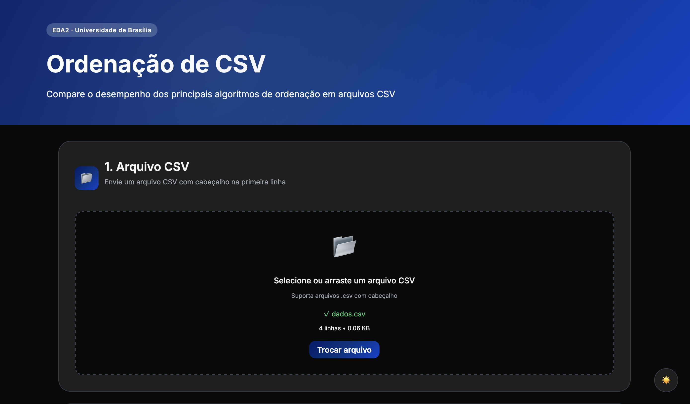
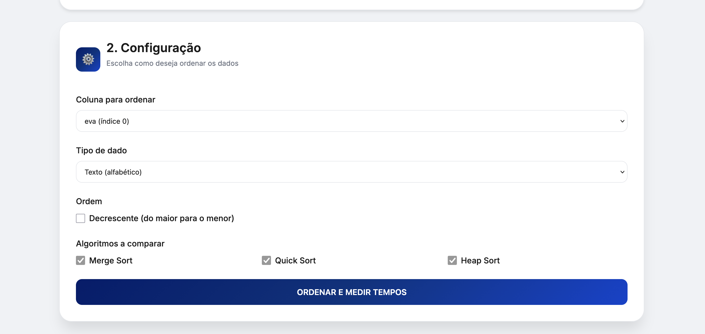
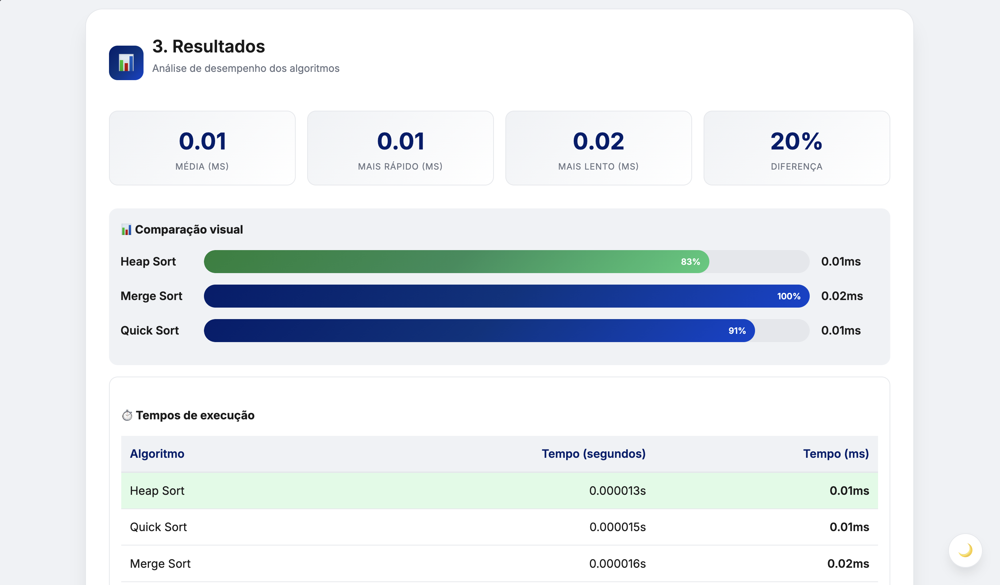
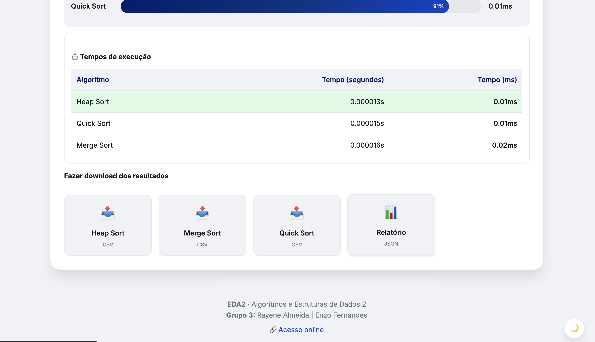

# G3_Ordenacao_EDA2-2026.1

## Grupo 3
|Matrícula | Aluno |
| -- | -- |
| 22/1022720  | Rayene Ferreira Almeida |
| 20/2017361  | Enzo Fernandes Borges   |

## Sobre 
Script em Python para ordenar arquivos CSV por uma coluna-chave usando algoritmos clássicos de ordenação (Merge Sort, Quick Sort e Heap Sort). O projeto permite executar os três algoritmos simultaneamente com uma única flag, comparando seus desempenhos.

### Funcionalidades:
- Upload de arquivo CSV;
- Escolha de coluna, tipo e ordem;
- Execução dos 3 algoritmos;
- Download dos arquivos ordenados;
- Comparação de desempenho;
- Relatório de Resumo em JSON;
- Download dos Resultados.

## Formato de entrada/saida
- Entrada: arquivo CSV com cabeçalho obrigatorio;
- Coluna-chave: informada por nome de coluna;
- Delimitador padrão: virgula (,);
- Encoding padrao: UTF-8.
- Saida: gera um novo arquivo para cada algoritmo no formato:
  - <arquivo>merge_ordenado.csv
  - <arquivo>quick_ordenado.csv
  - <arquivo>heap_ordenado.csv

## Acesso Online

O sistema está disponível online em:
[https://g3-ordenacao-eda-2-2026-1.vercel.app/](https://g3-ordenacao-eda-2-2026-1.vercel.app/)

## Screenshots

  
   
  <em>Tela com upload de arquivo CSV e configurações</em>

 

  
   
  <em>Tela Dark Mode</em>

 

  
   
  <em>Tela de configurações</em>

 

  
   
  <em>Tela de Resultados</em>

 

  
   
  <em>Tela de Resultados Parte 2</em>

 

## Video

  

  <b>Autores:</b>
  <a href="https://github.com/rayenealmeida">Rayene Almeida</a> e 
  <a href="https://github.com/enzo-fb">Enzo Fernandes</a>

